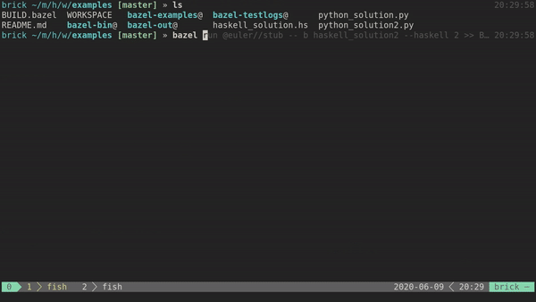

# rules_euler :abacus:
[](https://github.com/dmadisetti/rules_euler)
[](https://creativecommons.org/licenses/by-nc-sa/4.0/)

## About

`rules_euler` is a
[Bazel](https://docs.bazel.build/versions/master/bazel-overview.html) library
for quickly iterating one's way through [Project
Euler](https://projecteuler.net) problems. Using a [repositories of verified
answers](https://github.com/davidcorbin/euler-offline), you can test, run, and
verify your problems. It should just work out of the box:

<p align="center">
  
</p>

We also provide some nice helpers to make development even easier. Want to see
this code in use? Check out my [haskell Project Euler
repository](https://github.com/dmadisetti/painfulhaskell).

## Commerical Use
Commercial use is not allowed, as Project Euler questions are licensed under
[Non-Commercial Creative Commons](https://projecteuler.net/copyright), which
come from our data source dependency
[euler-offline](https://github.com/davidcorbin/euler-offline) by David Corbin
and [PocketEuler](https://github.com/imsky/PocketEuler) by imsky.

## Usage

This project exposes the `euler_test` rule, which will compare your code
against known answers. The easiest way to get started is by including the
following in your `WORKSPACE` file:

```starlark
http_archive(
    name = "euler",
    strip_prefix = "euler-1.0",
    urls = ["https://github.com/dmadisetti/rules_euler/archive/v1.0.tar.gz"],
)

load("@euler//:euler.bzl", "euler_repositories", "euler_test")

euler_repositories()
```

To test one of your solutions, put the following in your `BUILD` file:

```starlark
load(
    "@euler//:euler.bzl",
    "euler_test",
)

py_binary(
    name = "my_brilliant_python_solution_for_7",
    srcs = ["my_brilliant_python_solution_for_7.py"], # This is your code!
)

euler_test(
    name = "euler_7_test", # A name for you to keep track of the problem attempt.
    problem = 7, # The problem number you're solving. in this case we're doing 7
    solution = ":my_brilliant_python_solution_for_7", # It doesn't have to be a python solution, it just needs to be executable.
)
```

Now when you run `bazel test :euler_7_test`, you can determine whether you got the correct answer or not.

The best way to wrap your head around this might be by heading over to the
[example
directory](https://github.com/dmadisetti/rules_euler/tree/master/examples). In
addition to python, there are haskell examples.

## External Files

For problems that require additional files, you can access them directly
through the `euler_rules` project. To do this, use a `@euler//:external_files`
data dependency, and you can then access the file in
`external/euler/files/<file>`. Refer to
[`file_example.hs`](https://github.com/dmadisetti/rules_euler/blob/master/examples/file_example.hs)
and the respective [BUILD
rules](https://github.com/dmadisetti/rules_euler/blob/master/examples/BUILD.bazel#L66)
for an example on this.

## Scripts

A few helper scripts are provided. `bazel run @euler/examine <problem>` Will
show you the text for a given problem:

```txt
@euler//examine [--parse|--answer] PROBLEM [PROBLEM_FILE]
```

and `bazel run @euler//stub -- --haskell <problem>` will create a commented
code stub for your use:

```txt
@euler//stub [b name]? [--python|--haskell] PROBLEM [PROBLEM_FILE]
```

The best way to use this is with redirection, e.g. `bazel run @euler//stub --
--python 137 > problem_137.py`. You can also generate the build rules with
`bazel run @euler//stub b my_file_name $PROBLEM`. I wrapped these in a shell
script and forgot about it. E.g.

```bash
#!/usr/bin/env bash
# euler.sh

PROBLEM=$1
NAMING_SCHEME="euler_${PROBLEM}"

pushd ~/projects/my_euler_stuff

bazel run @euler//stub -- b ${NAMING_SCHEME} --haskell $PROBLEM >> BUILD
bazel run @euler//stub -- --haskell $PROBLEM > ${NAMING_SCHEME}.hs

vim ${NAMING_SCHEME}.hs
popd
```

## TODO

  - Allow for better templating with stubs. PRs welcome.
  - Consolidate data sources.

## Solutions using `rules_euler`

  - PainfulHaskell - dmadisetti
  - **YourContribution** - You
